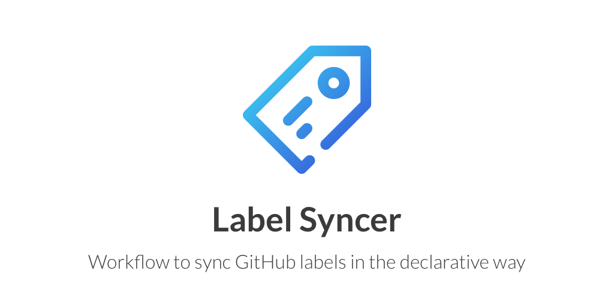
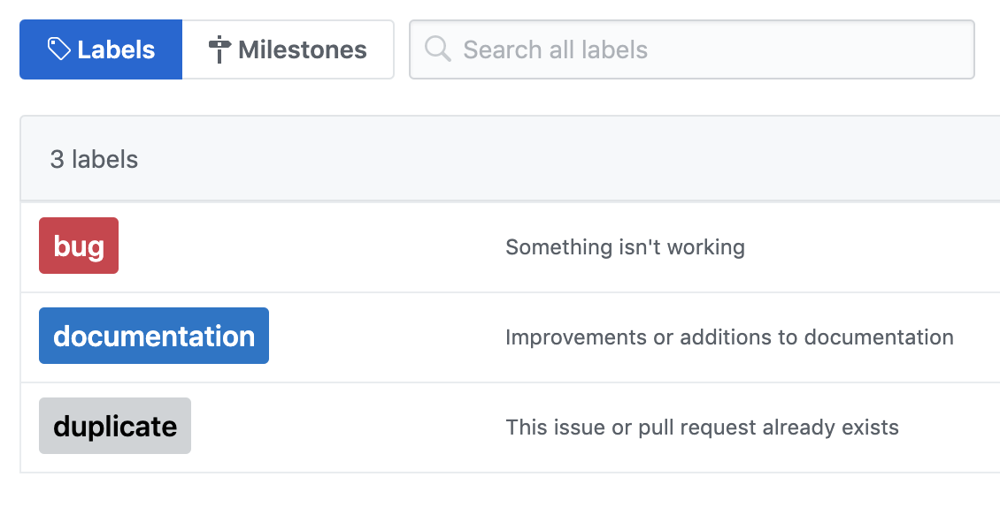

[![actions-workflow-test][actions-workflow-test-badge]][actions-workflow-test]
[![actions-marketplace][actions-marketplace-badge]][actions-marketplace]
[![release][release-badge]][release]
[![pkg.go.dev][pkg.go.dev-badge]][pkg.go.dev]
[![dependabot][dependabot-badge]][dependabot]
[![license][license-badge]][license]

GitHub Actions workflow to sync GitHub labels in the declarative way.

By using this workflow, you can sync current labels with labels configured in a YAML manifest.

## Usage

### Create YAML manifest of GitHub labels

```yaml
- name: bug
  description: Something isn't working
  color: d73a4a
- name: documentation
  description: Improvements or additions to documentation
  color: 0075ca
- name: duplicate
  description: This issue or pull request already exists
  color: cfd3d7
```



The default file path is `.github/labels.yml`, but you can specify any file path with `jobs.<job_id>.steps.with.manifest`.

To create manifest of the current labels easily, using [label-exporter](https://github.com/micnncim/label-exporter) is recommended.

### Create Workflow

An example workflow is here.

```yaml
name: Sync labels
on:
  push:
    branches:
      - master
    paths:
      - path/to/manifest/labels.yml
jobs:
  build:
    runs-on: ubuntu-latest
    steps:
      - uses: actions/checkout@v2
      - uses: micnncim/action-label-syncer@v1
        env:
          GITHUB_TOKEN: ${{ secrets.GITHUB_TOKEN }}
        with:
          manifest: path/to/manifest/labels.yml
```

If a label color changes, the same label is updated with the new color. If a label name changes, the previous label is deleted by default.
Also all existing labels which not listed in `manifest` will be deleted by default.
All issues and PRs that were previously labeled with this label are now unlabeled.

You can add `jobs.<job_id>.steps.with.prune: false` in order to preserver all existing labels which is not mentioned in `manifest`, in this case when a label will be renamed old label will be not deleted.

## Sync labels on another repository

It is also possible to specify a repository as an input to the action. This is useful if you want to store your labels somewhere centrally and modify multiple repository labels.

**Note: The default `GITHUB_TOKEN` will not have permissions to operate on other repositories so you must specify a personal access token in your secrets.**

```yaml
name: Sync labels
on:
  push:
    branches:
      - master
    paths:
      - path/to/manifest/labels.yml
jobs:
  build:
    runs-on: ubuntu-latest
    steps:
      - uses: actions/checkout@v2
      - uses: micnncim/action-label-syncer@v1
        with:
          manifest: path/to/manifest/labels.yml
          repository: myother/repository
          token: ${{ secrets.PERSONAL_TOKEN }}
```

## Project using action-label-syncer

- [cloudalchemy/ansible-prometheus](https://github.com/cloudalchemy/ansible-prometheus)
- [cloudalchemy/ansible-grafana](https://github.com/cloudalchemy/ansible-grafana)
- [cloudalchemy/ansible-node-exporter](https://github.com/cloudalchemy/ansible-node-exporter)
- [cloudalchemy/ansible-fluentd](https://github.com/cloudalchemy/ansible-fluentd)
- [cloudalchemy/ansible-alertmanager](https://github.com/cloudalchemy/ansible-alertmanager)
- [cloudalchemy/ansible-blackbox-exporter](https://github.com/cloudalchemy/ansible-blackbox-exporter)
- [cloudalchemy/ansible-pushgateway](https://github.com/cloudalchemy/ansible-pushgateway)
- [cloudalchemy/ansible-coredns](https://github.com/cloudalchemy/ansible-coredns)
- [sagebind/isahc](https://github.com/sagebind/isahc)
- [JulienBreux/baleia](https://github.com/JulienBreux/baleia)

If you're using `action-label-syncer` in your project, please send a PR to list your project!

## See also

- [Prow](https://github.com/kubernetes/test-infra/tree/master/prow)
- [actions/labeler](https://github.com/actions/labeler)
- [lannonbr/issue-label-manager-action](https://github.com/lannonbr/issue-label-manager-action)
- [b4b4r07/github-labeler](https://github.com/b4b4r07/github-labeler)

## Note

_Icon made by bqlqn from [www.flaticon.com](https://www.flaticon.com)_

<!-- badge links -->

[actions-workflow-test]: https://github.com/micnncim/action-label-syncer/actions?query=workflow%3ACI
[actions-workflow-test-badge]: https://img.shields.io/github/workflow/status/micnncim/action-label-syncer/CI?label=CI&style=for-the-badge&logo=github
[actions-marketplace]: https://github.com/marketplace/actions/label-syncer
[actions-marketplace-badge]: https://img.shields.io/badge/marketplace-label%20syncer-blue?style=for-the-badge&logo=github
[release]: https://github.com/micnncim/action-label-syncer/releases
[release-badge]: https://img.shields.io/github/v/release/micnncim/action-label-syncer?style=for-the-badge&logo=github
[pkg.go.dev]: https://pkg.go.dev/github.com/micnncim/action-label-syncer?tab=overview
[pkg.go.dev-badge]: https://img.shields.io/badge/pkg.go.dev-reference-02ABD7?style=for-the-badge&logoWidth=25&logo=data%3Aimage%2Fsvg%2Bxml%3Bbase64%2CPHN2ZyB4bWxucz0iaHR0cDovL3d3dy53My5vcmcvMjAwMC9zdmciIHZpZXdCb3g9Ijg1IDU1IDEyMCAxMjAiPjxwYXRoIGZpbGw9IiMwMEFERDgiIGQ9Ik00MC4yIDEwMS4xYy0uNCAwLS41LS4yLS4zLS41bDIuMS0yLjdjLjItLjMuNy0uNSAxLjEtLjVoMzUuN2MuNCAwIC41LjMuMy42bC0xLjcgMi42Yy0uMi4zLS43LjYtMSAuNmwtMzYuMi0uMXptLTE1LjEgOS4yYy0uNCAwLS41LS4yLS4zLS41bDIuMS0yLjdjLjItLjMuNy0uNSAxLjEtLjVoNDUuNmMuNCAwIC42LjMuNS42bC0uOCAyLjRjLS4xLjQtLjUuNi0uOS42bC00Ny4zLjF6bTI0LjIgOS4yYy0uNCAwLS41LS4zLS4zLS42bDEuNC0yLjVjLjItLjMuNi0uNiAxLS42aDIwYy40IDAgLjYuMy42LjdsLS4yIDIuNGMwIC40LS40LjctLjcuN2wtMjEuOC0uMXptMTAzLjgtMjAuMmMtNi4zIDEuNi0xMC42IDIuOC0xNi44IDQuNC0xLjUuNC0xLjYuNS0yLjktMS0xLjUtMS43LTIuNi0yLjgtNC43LTMuOC02LjMtMy4xLTEyLjQtMi4yLTE4LjEgMS41LTYuOCA0LjQtMTAuMyAxMC45LTEwLjIgMTkgLjEgOCA1LjYgMTQuNiAxMy41IDE1LjcgNi44LjkgMTIuNS0xLjUgMTctNi42LjktMS4xIDEuNy0yLjMgMi43LTMuN2gtMTkuM2MtMi4xIDAtMi42LTEuMy0xLjktMyAxLjMtMy4xIDMuNy04LjMgNS4xLTEwLjkuMy0uNiAxLTEuNiAyLjUtMS42aDM2LjRjLS4yIDIuNy0uMiA1LjQtLjYgOC4xLTEuMSA3LjItMy44IDEzLjgtOC4yIDE5LjYtNy4yIDkuNS0xNi42IDE1LjQtMjguNSAxNy05LjggMS4zLTE4LjktLjYtMjYuOS02LjYtNy40LTUuNi0xMS42LTEzLTEyLjctMjIuMi0xLjMtMTAuOSAxLjktMjAuNyA4LjUtMjkuMyA3LjEtOS4zIDE2LjUtMTUuMiAyOC0xNy4zIDkuNC0xLjcgMTguNC0uNiAyNi41IDQuOSA1LjMgMy41IDkuMSA4LjMgMTEuNiAxNC4xLjYuOS4yIDEuNC0xIDEuN3oiLz48cGF0aCBmaWxsPSIjMDBBREQ4IiBkPSJNMTg2LjIgMTU0LjZjLTkuMS0uMi0xNy40LTIuOC0yNC40LTguOC01LjktNS4xLTkuNi0xMS42LTEwLjgtMTkuMy0xLjgtMTEuMyAxLjMtMjEuMyA4LjEtMzAuMiA3LjMtOS42IDE2LjEtMTQuNiAyOC0xNi43IDEwLjItMS44IDE5LjgtLjggMjguNSA1LjEgNy45IDUuNCAxMi44IDEyLjcgMTQuMSAyMi4zIDEuNyAxMy41LTIuMiAyNC41LTExLjUgMzMuOS02LjYgNi43LTE0LjcgMTAuOS0yNCAxMi44LTIuNy41LTUuNC42LTggLjl6bTIzLjgtNDAuNGMtLjEtMS4zLS4xLTIuMy0uMy0zLjMtMS44LTkuOS0xMC45LTE1LjUtMjAuNC0xMy4zLTkuMyAyLjEtMTUuMyA4LTE3LjUgMTcuNC0xLjggNy44IDIgMTUuNyA5LjIgMTguOSA1LjUgMi40IDExIDIuMSAxNi4zLS42IDcuOS00LjEgMTIuMi0xMC41IDEyLjctMTkuMXoiLz48L3N2Zz4=
[dependabot]: https://github.com/micnncim/action-label-syncer/pulls?q=is:pr%20author:app/dependabot-preview
[dependabot-badge]: https://img.shields.io/badge/dependabot-enabled-blue?style=for-the-badge&logo=dependabot
[license]: LICENSE
[license-badge]: https://img.shields.io/github/license/micnncim/action-label-syncer?style=for-the-badge
