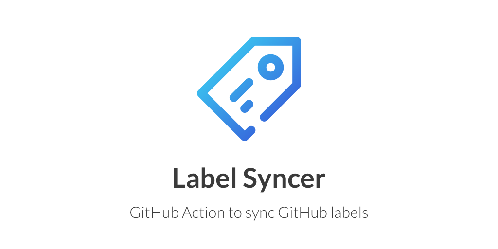

[![actions-workflow-test][actions-workflow-test-badge]][actions-workflow-test]
[![actions-marketplace][actions-marketplace-badge]][actions-marketplace]
[![release][release-badge]][release]
[![go-version][go-version-badge]][go-version]
[![pkg.go.dev][pkg.go.dev-badge]][pkg.go.dev]
[![dependabot][dependabot-badge]][dependabot]
[![license][license-badge]][license]

GitHub Actions workflow to sync GitHub labels in the declarative way.

By using this workflow, you can sync current labels with labels configured in a YAML manifest.

## Usage

### Create YAML manifest of GitHub labels

```yaml
- name: bug
  description: Something isn't working
  color: d73a4a
- name: documentation
  description: Improvements or additions to documentation
  color: 0075ca
- name: duplicate
  description: This issue or pull request already exists
  color: cfd3d7
```


The default file path is `.github/labels.yml`, but you can specify any file path with `jobs.<job_id>.steps.with`.

To create manifest of the current labels easily, using [label-exporter](https://github.com/micnncim/label-exporter) is recommended.

### Create Workflow

An example workflow is here.

```yaml
name: Sync labels
on:
  push:
    branches:
      - master
    paths:
      - path/to/manifest/labels.yml
jobs:
  build:
    runs-on: ubuntu-latest
    steps:
      - uses: actions/checkout@v2
      - uses: micnncim/action-label-syncer@v1
        env:
          GITHUB_TOKEN: ${{ secrets.GITHUB_TOKEN }}
        with:
          manifest: path/to/manifest/labels.yml
```

## Project using action-label-syncer

- [cloudalchemy/ansible-prometheus](https://github.com/cloudalchemy/ansible-prometheus)
- [cloudalchemy/ansible-grafana](https://github.com/cloudalchemy/ansible-grafana)
- [cloudalchemy/ansible-node-exporter](https://github.com/cloudalchemy/ansible-node-exporter)
- [cloudalchemy/ansible-fluentd](https://github.com/cloudalchemy/ansible-fluentd)
- [cloudalchemy/ansible-alertmanager](https://github.com/cloudalchemy/ansible-alertmanager)
- [cloudalchemy/ansible-blackbox-exporter](https://github.com/cloudalchemy/ansible-blackbox-exporter)
- [cloudalchemy/ansible-pushgateway](https://github.com/cloudalchemy/ansible-pushgateway)
- [cloudalchemy/ansible-coredns](https://github.com/cloudalchemy/ansible-coredns)
- [sagebind/isahc](https://github.com/sagebind/isahc)
- [JulienBreux/baleia](https://github.com/JulienBreux/baleia)

If you're using `action-label-syncer` in your project, please send a PR to list your project!

## See also

- [Prow](https://github.com/kubernetes/test-infra/tree/master/prow)
- [actions/labeler](https://github.com/actions/labeler)
- [lannonbr/issue-label-manager-action](https://github.com/lannonbr/issue-label-manager-action)
- [b4b4r07/github-labeler](https://github.com/b4b4r07/github-labeler)

## Note

*Icon made by bqlqn from [www.flaticon.com](https://www.flaticon.com)*

<!-- badge links -->

[actions-workflow-test]: https://github.com/micnncim/action-label-syncer/actions?query=workflow%3ACI
[actions-marketplace]: https://github.com/marketplace/actions/label-syncer
[release]: https://github.com/micnncim/action-label-syncer/releases
[go-version]: go.mod
[pkg.go.dev]: https://pkg.go.dev/github.com/micnncim/action-label-syncer
[dependabot]: https://github.com/micnncim/action-label-syncer/pulls?q=is:pr%20author:app/dependabot-preview
[license]: LICENSE

[actions-workflow-test-badge]: https://img.shields.io/github/workflow/status/micnncim/action-label-syncer/CI?label=CI&style=for-the-badge&logo=github
[actions-marketplace-badge]: https://img.shields.io/badge/marketplace-label%20syncer-blue?style=for-the-badge&logo=github
[release-badge]: https://img.shields.io/github/v/release/micnncim/action-label-syncer?style=for-the-badge&logo=github
[go-version-badge]: https://img.shields.io/github/go-mod/go-version/micnncim/action-label-syncer?logo=go&style=for-the-badge
[pkg.go.dev-badge]: https://img.shields.io/badge/pkg.go.dev-reference-blue?style=for-the-badge&logo=go
[dependabot-badge]: https://img.shields.io/badge/dependabot-enabled-blue?style=for-the-badge&logo=dependabot
[license-badge]: https://img.shields.io/github/license/micnncim/action-label-syncer?style=for-the-badge
